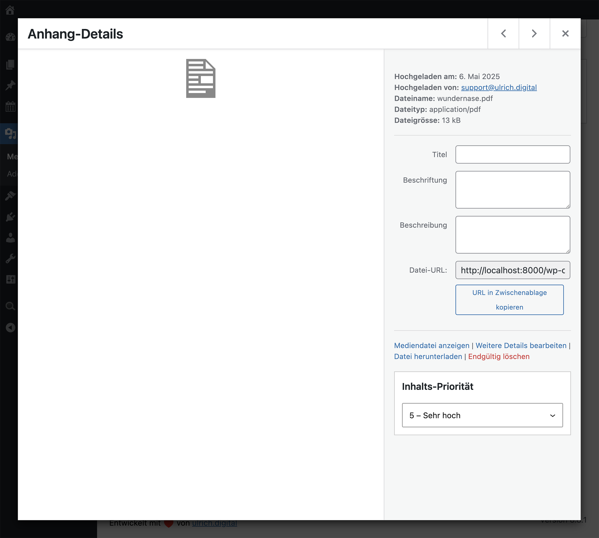

# Content Priority Manager

Ein WordPress-Plugin zur Vergabe und Verwaltung von Inhalts-Prioritäten für PDF-Dateien, Beiträge, Seiten und Custom Post Types (CPTs). Ideal zur inhaltlichen Gewichtung und Sortierung – z. B. in Kombination mit Ajax Search Pro.

## Funktionen

* Prioritätsfeld (1–5) für:

  * **PDF-Dateien** (über Anhang-Details in der Mediathek)
  * **Beiträge, Seiten und CPTs** (über Gutenberg-Sidebar)
* Automatische Vergabe der Standard-Priorität **„3“ beim PDF-Upload**
* Speicherung als Custom Field:

  * `pdf_priority` für Anhänge
  * `content_priority` für alle anderen Inhalte
* Kompatibel mit **Ajax Search Pro** zur Priorisierung von Suchergebnissen
* **Optionenseite** zur gezielten Aktivierung pro Inhaltstyp und Medientyp (PDFs, Bilder, Videos, Audios, Post Types, Ajax Search Pro)

## Optionen im Backend

Die Plugin-Einstellungen finden sich unter
**Einstellungen → Content Priority Manager**

### Mögliche Optionen:

* **Medientypen auswählen**, für die das Prioritätsfeld erscheinen soll  
  (z. B. PDF, Bilder, Videos, Audios)
* **Aktive Post Types auswählen** (z. B. `post`, `page`, CPTs)
* **Ajax Search Pro-Unterstützung aktivieren**  
  → Fügt automatisch den nötigen Filter zur Ergebnis-Priorisierung hinzu

## Integration mit Ajax Search Pro

* Inhalte mit höherer Priorität (PDFs, Beiträge etc.) erscheinen weiter oben in den Suchergebnissen
* Die Sortierung erfolgt **automatisch per Filter** – kein manuelles Eingreifen nötig
* Funktioniert nur im **Regular Engine Mode** (nicht „Index Table Engine“)

## Screenshots 

**Sidebar im Gutenberg-Editor** mit Prioritätswahl

*Abbildung: Sidebar im Editor.*

**Medienansicht (PDF-Datei)** mit Prioritätsfeld

*Abbildung: Prioriätsfeld in der Medienansicht.*

**Einstellungen im Adminbereich**
    
    *Abbildung: Optionen-Seite.*

## Technische Details

| Metafield          | Post Type            | Typ        |
| ------------------ | -------------------- | ---------- |
| `pdf_priority`     | `attachment` (PDF)   | Zahl (1–5) |
| `content_priority` | `post`, `page`, CPTs | Zahl (1–5) |

## Installation

1. Plugin in den Ordner `wp-content/plugins/` kopieren
2. Im WordPress-Backend aktivieren
3. PDFs oder Beiträge bearbeiten, um Prioritäten zu setzen
4. Optional: Ajax Search Pro aktivieren, um Suchergebnisse nach Priorität zu sortieren
